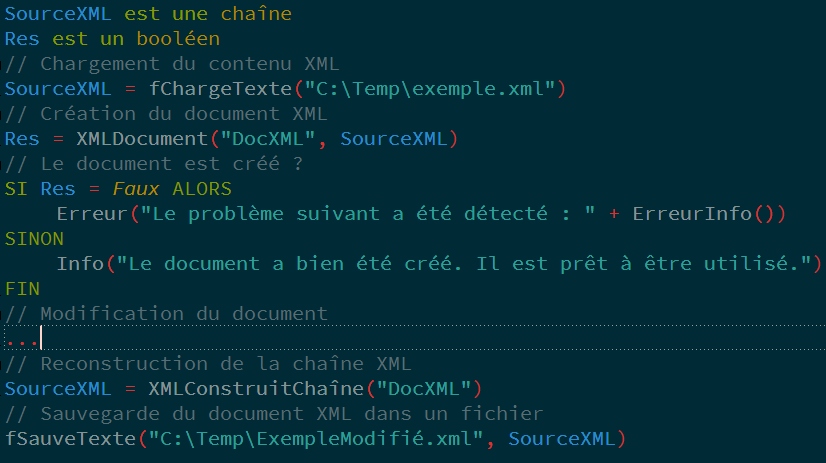

WINDEV-Solarized
====================
Solarized Colorscheme for PC SOFT - WINDEV

***

Original Solarized color scheme developed by Ethan Schoonover <es@ethanschoonover.com>

See the [Solarized homepage](http://ethanschoonover.com/solarized) for screenshots, 
details and colorscheme versions for Vim, Mutt, popular terminal emulators and 
other applications.

Installation
------------

### Import settings

1. Clone (or download) this repository.
2. Go to **Menu principal > Outils > Options > Options de l'éditeur de code **
3. Select **Coloration**
4. Click on **Importer un thème**
5. Select **solarized.sco**

Note About Fonts
-----------------

Unfortunately, font settings are included in the color settings files. It is currently set to Consolas.
You should probably modify these after adding the color schemes.

Screenshot
-----------------

Screenshot of WINDEV-Solarized in action:  

